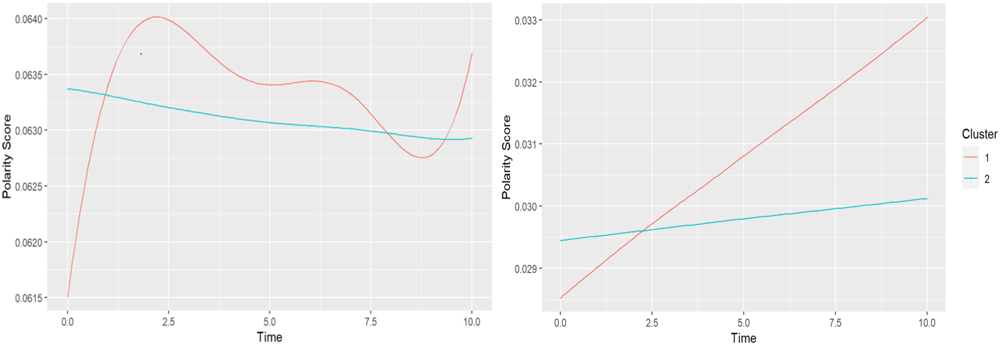

---

##### Download

+ [Paper](https://onlinelibrary.wiley.com/doi/full/10.1111/sode.12733)
+ [Code and data](https://osf.io/?view_only=c96818e4b23348ceaa6db76081288d7c)

---

##### Abstract

This study employed text mining and sentiment analysis on over 8,800 mother-child conversation transcripts to examine dynamic patterns of emotion expression, revealing distinct temporal trends in emotional sentiment for both mothers and children. The research identified clusters of mothers and children with varying emotion expression patterns, and demonstrated how mother-child polarity score differences fluctuated throughout conversations, showcasing the potential of these analytical methods for understanding parent-child interactions and informing relationship-focused interventions.
---

##### Figure 6: The Clusters of Mother Polarity and Child Polarity over time 



---

##### Citation

Liu, C., & Chen, C. (2024). Text Mining and Sentiment Analysis: A New Lens to Explore the Emotion Dynamics of Mother-Child Interactions. *Social Development*, 33, e12733. https://doi.org/10.1111/sode.12733.

```BibTeX
@article{https://doi.org/10.1111/sode.12733,
author = {Liu, Chao and Chen, Charis},
title = {Text mining and sentiment analysis: A new lens to explore the emotion dynamics of mother-child interactions},
journal = {Social Development},
volume = {33},
number = {3},
pages = {e12733},
keywords = {cluster analysis, emotion dynamics, generalized additive models, mother-child interactions, piecewise linear regression, sentiment analysis, text mining},
doi = {https://doi.org/10.1111/sode.12733},
url = {https://onlinelibrary.wiley.com/doi/abs/10.1111/sode.12733}}
```

---

