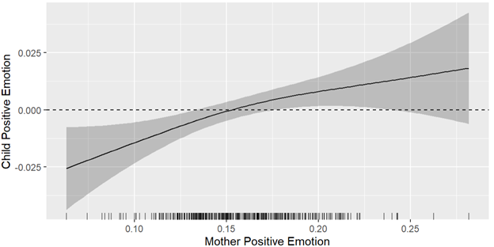
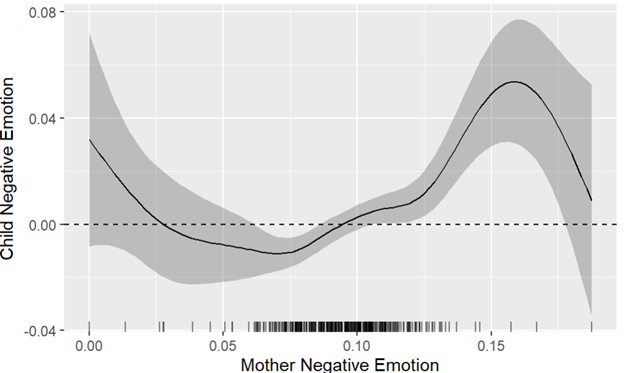

##### Download

+ [Paper](https://journals.sagepub.com/doi/10.1177/01650254241242662)
+ [Code and data](https://osf.io/mjrt6/?view_only=d2d18e16274a4ab7bdf3587eae35be02)

---

##### Abstract

This study utilized text mining and sentiment analysis on mother-child conversations to examine the developmental trends in their interactions from early to middle childhood. The findings revealed a shift towards more balanced interactions as children age, with increased turn-taking dynamics and linguistic congruence, as well as a complex interdependence of expressed emotions between mothers and children over time.

---

##### Figure 1: The Smooth Effect of Mother Positive Emotion on Child Positive Emotion 



##### Figure 2: The Smooth Effect of Mother Negative Emotion on Child Negative Emotion



---

##### Citation

Liu, C., & Waltz, K. (2024). Unveiling the tapestry of mother–child interactions through text mining and sentiment analysis. *International Journal of Behavioral Development*, 0(0). https://doi.org/10.1177/01650254241242662

```BibTeX
@article{doi:10.1177/01650254241242662,
author = {Chao Liu and Kira Waltz},
title ={Unveiling the tapestry of mother–child interactions through text mining and sentiment analysis},
journal = {International Journal of Behavioral Development},
volume = {0},
number = {0},
pages = {01650254241242662},
year = {0},
doi = {10.1177/01650254241242662},
URL = {https://doi.org/10.1177/01650254241242662}}
```

---

