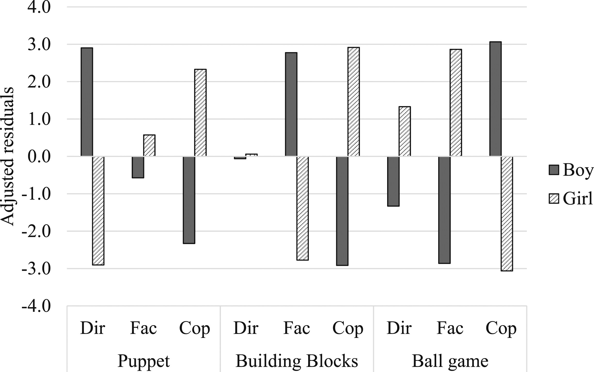
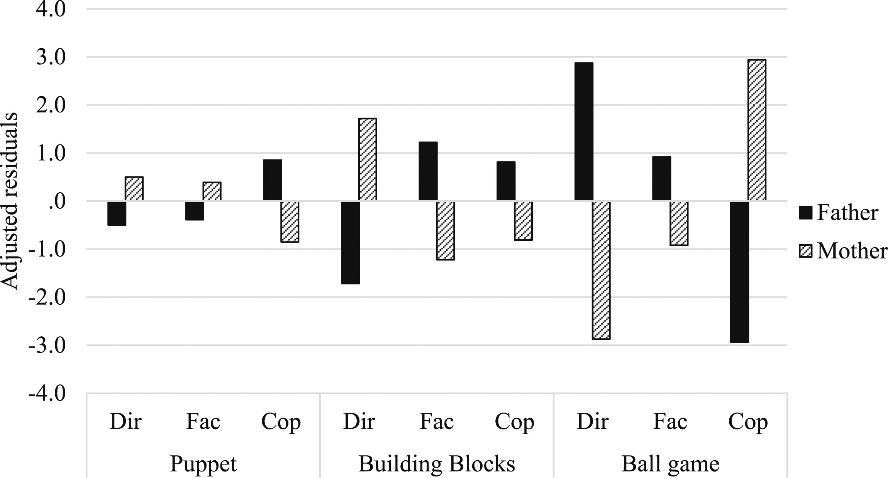

---

##### Relevant Links

+ [Paper](https://journals.sagepub.com/doi/full/10.1177/0192513X241263782)

---

##### Abstract

This study observed 81 children playing with their mothers and fathers separately to examine how parent and child gender, as well as play context, influenced parental play roles. The findings revealed complex interactions between gender and play context, with parents adopting different roles (director, facilitator, or co-player) based on the child's gender and the type of game, highlighting the significant impact of these factors on parent-child play dynamics.

---

##### Figure 1: Adjusted residuals for counts of parental roles (Dir = Director, Fac = Facilitator, Co-P = Co-player) comparing boys with girls within three play contexts. 



##### Figure 2: Adjusted residuals for counts of different parental roles (Dir = Director, Fac = Facilitator, Co-P = Co-player) comparing fathers with mothers within three play contexts.



---

##### Citation

Liu, C., Harrist, A. W., Cookston, J. T., & Carrillo, S. (2024). How Parents Play: Play Style as a Function of Gender of Parent, Gender of Child, and Play Context. *Journal of Family Issues*, 0(0). https://doi.org/10.1177/0192513X241263782.

```BibTeX
@article{doi:10.1177/0192513X241263782,
author = {Chao Liu and Amanda W. Harrist and Jeffrey T. Cookston and Sonia Carrillo},
title ={How Parents Play: Play Style as a Function of Gender of Parent, Gender of Child, and Play Context},
journal = {Journal of Family Issues},
volume = {0},
number = {0},
pages = {0192513X241263782},
year = {0},
doi = {10.1177/0192513X241263782},
URL = {https://doi.org/10.1177/0192513X241263782}}
```

---