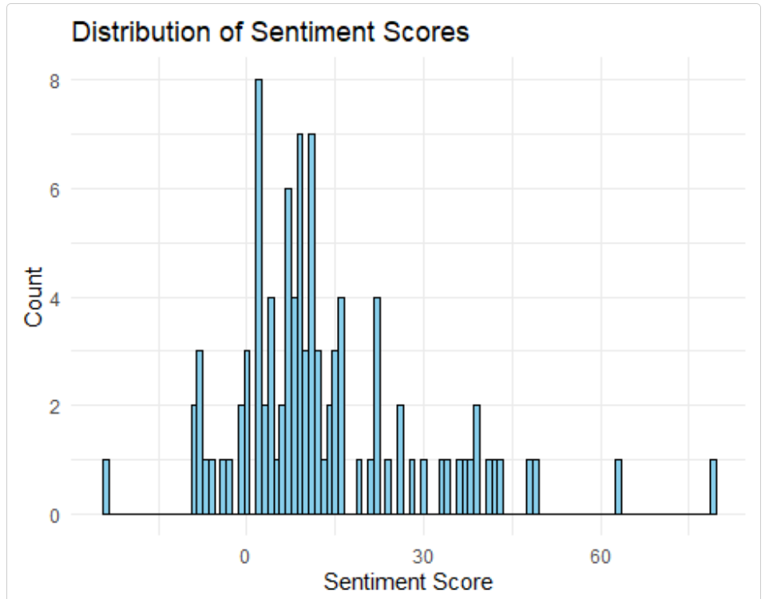

*Goodreader* is a comprehensive toolkit for scraping and analyzing book data from Goodreads.

## Installing and loading the package
Install the package:

    install.packages("Goodreader")
And load the package:

    library(Goodreader)

## Searching for Books on Goodreads
The `search_goodreads()` function allows you to search for books on Goodreads based on various criteria.

The code below searches for books that include the term “parenting” in the title and returned 10 books sorted by readers’ ratings

    parent_df <- search_goodreads(search_term = "parenting", search_in = "title", num_books = 10, sort_by = "ratings")
    summary(parent_df)
    #>   title              author            book_id         
    #> Length:10          Length:10          Length:10         
    #> Class :character   Class :character   Class :character  
    #> Mode  :character   Mode  :character   Mode  :character  

    #>     url               ratings     
    #> Length:10          Min.   : 8427  
    #> Class :character   1st Qu.:11744  
    #> Mode  :character   Median :13662  
    #>                    Mean   :19757  
    #>                    3rd Qu.:13784  
    #>                    Max.   :69591  

You can also search author’s name:

    search_goodreads(search_term = "J.K. Rowling", search_in = "author", num_books = 5, sort_by = "ratings") 
The `search_goodreads()` function includes a `sort_by` that sorts the results either by ratings or published_year:

    search_goodreads(search_term = "J.K. Rowling", search_in = "author", num_books = 5, sort_by = "published_year") 

## Scrape book metadata and reviews
After the books are found, save their IDs to a text file. These IDs are used for extracting book metadata and reviews:

    get_book_ids(input_data = parent_df, file_name = "parent_books.txt") #the book IDs are now stored in a text file named “parent_books”
Book metadata can then be scraped:

    parent_bookinfo <- scrape_books(book_ids_path = "parent_books.txt", use_parallel = FALSE)
To speed up the scraping process, we can turn on the parallel process: `use_parallel = TRUE`, and specify the number of cores for the parallel process (e.g., `num_cores = 8`)

    parent_bookreviews <- scrape_reviews(book_ids_path = "parent_books.txt", num_reviews = 10, use_parallel = FALSE) #users can also turn on parallel process to speed up the process

## Conduct sentiment analysis
The `analyze_sentiment()` function calculates the sentiment score of each review based on the lexicon chosen by the user. Available options for lexicon are afinn, bing, and nrc. Basic negation scope detection was implemented (e.g., not happy is labeled as negative emotion and is assigned with a negative score).

    sentiment_results <- analyze_sentiment(parent_bookreviews, lexicon = "afinn")
The `average_book_sentiment()` function calculates the average sentiment score for each book.

    ave_sentiment <- average_book_sentiment(sentiment_results)
    summary(ave_sentiment)
    #>    book_id          avg_sentiment  
    #>  Length:10          Min.   : 4.40  
    #>  Class :character   1st Qu.: 7.25  
    #>  Mode  :character   Median :12.86  
    #>                     Mean   :12.95  
    #>                     3rd Qu.:14.65  
    #>                     Max.   :27.30

The sentiment scores can be plotted as a histogram:

    sentiment_histogram(sentiment_results)

Or a trend of average sentiment score over time:

    sentiment_trend(sentiment_results, time_period = "year")
    
    

## Perform topic modeling
Apply topic modeling to the reviews data:

    reviews_topic <- model_topics(parent_bookreviews, num_topics = 3, num_terms = 10, english_only = TRUE)
    #> Topic 1:  
    #> parent, children, need, one, way, good, get, work, dont, give 
    #> 
    #> Topic 2:  
    #> parent, child, book, emot, feel, help, also, can, children, use 
    #> 
    #> Topic 3:  
    #> book, just, kid, think, read, like, time, say, realli, much
Plot the top terms by topic:

    plot_topic_terms(reviews_topic)

Create a word cloud for each topic:

    gen_topic_clouds(reviews_topic)
Topic 1:

Topic 2:

Topic 3:

## Other utility functions
The following table shows other utility functions to extract book-related information

| **Function**              | **Output** | **Description**                                                   |
|---------------------------|------------|-------------------------------------------------------------------|
| get_book_ids()            | Text file  | Retrieve the book IDs from the input data and save to a text file |
| get_book_summary()        | List       | Retrieve the summary for each book                                |
| get_author_info()         | List       | Retrieve the author information for each book                     |
| get_genres()              | List       | Extract the genres for each book                                  |
| get_published_time()      | List       | Retrieve the published time for each book                         |
| get_num_pages()           | List       | Retrieve the number of pages for each book                        |
| get_format_info()         | List       | Retrieve the format information for each book                     |
| get_rating_distribution() | List       | Retrieve the rating distribution for each book                    |
