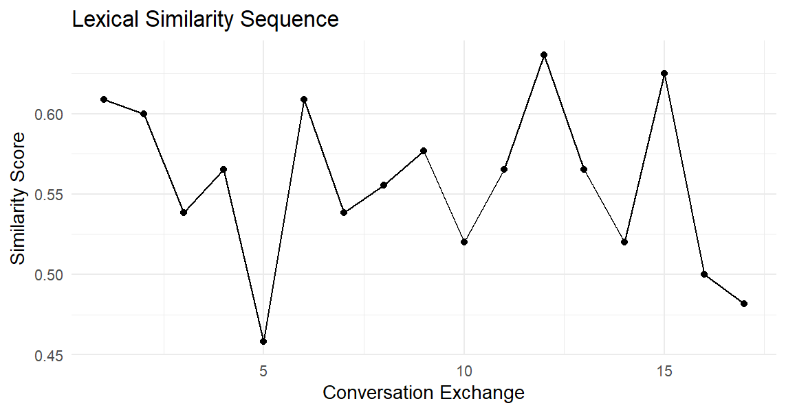
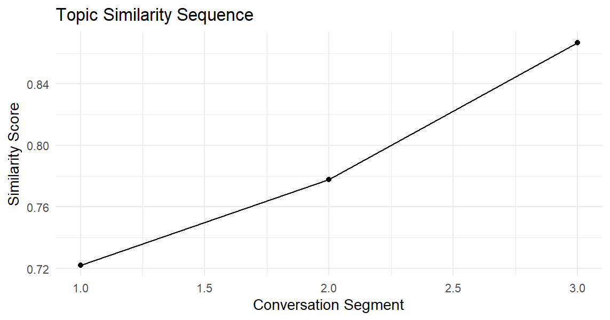
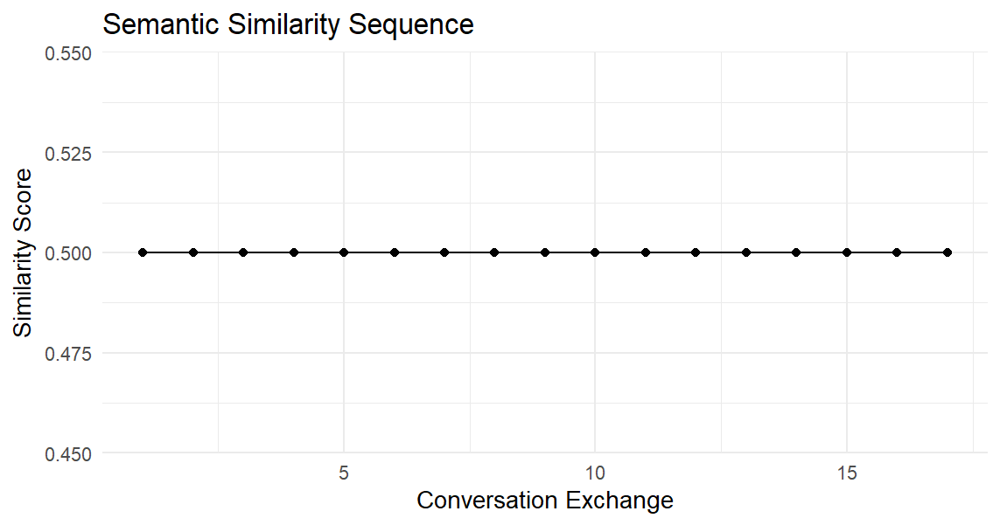
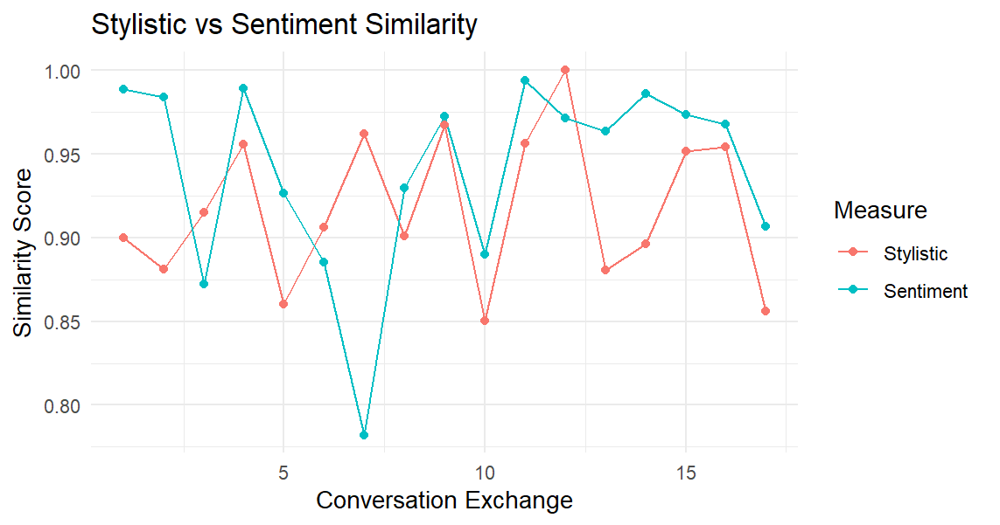
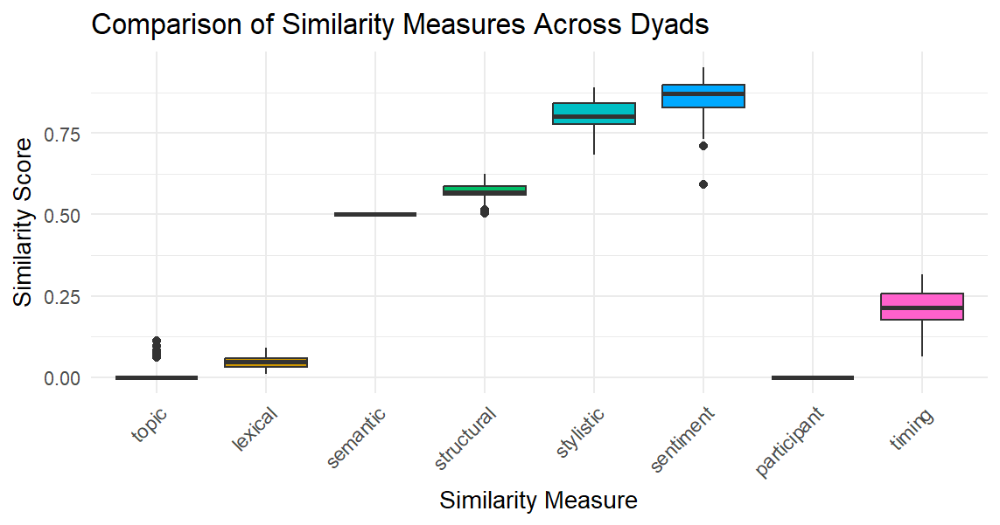
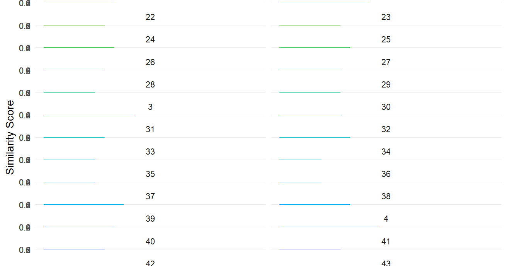

*Conversim* is a powerful R package for analyzing similarities in conversations across multiple dimensions. Whether you're studying dialogue dynamics, speech patterns, or conversational alignment, this package provides comprehensive tools for measuring topic, lexical, semantic, stylistic, sentiment, structural, and temporal similarities.

## Installing and Loading the Package

Install the package:

```r
install.packages("conversim")
```

Load the package along with required dependencies:

```r
library(conversim)
library(ggplot2)
library(lme4)
library(topicmodels)
library(tm)
library(slam)
```

## Understanding Conversation Data Structure

The conversim package works with conversation data that includes:
- **dyad_id**: Identifier for conversation pairs
- **speaker**: Person speaking (A, B, etc.)
- **text**: Raw conversation text
- **processed_text**: Cleaned and preprocessed text

## Analyzing Single Dyad Conversations

### Creating Sample Data

Let's start with a simple conversation between two speakers:

```r
set.seed(123)
conversation <- data.frame(
  speaker = rep(c("A", "B"), 10),
  processed_text = c(
    "Hello how are you today",
    "I'm doing well thanks for asking",
    "That's great to hear what are your plans",
    "I'm planning to go for a walk later",
    "Sounds nice the weather is beautiful",
    "Yes it's perfect for outdoor activities",
    "Do you often go for walks",
    "Yes I try to walk every day for exercise",
    "That's a great habit to have",
    "Thanks I find it helps me stay healthy",
    "Have you tried other forms of exercise",
    "I also enjoy swimming and yoga",
    "Those are excellent choices too",
    "What about you what exercise do you prefer",
    "I like running and playing tennis",
    "Tennis is fun do you play often",
    "I try to play at least once a week",
    "That's a good frequency to maintain",
    "Yes it keeps me active and social",
    "Social aspects of exercise are important too"
  )
)
```

### Text Preprocessing

Before analysis, preprocess your conversation data:

```r
preprocess_dyads <- function(conversations) {
  conversations$processed_text <- sapply(conversations$text, function(text) {
    text <- tolower(text)
    text <- gsub("[[:punct:]]", "", text)
    text <- gsub("[[:digit:]]", "", text)
    text <- gsub("\\s+", " ", trimws(text))
    return(text)
  })
  
  # Remove empty processed texts
  conversations <- conversations[nchar(conversations$processed_text) > 0, ]
  return(conversations)
}
```

### Lexical Similarity Sequence

Track how lexical similarity evolves throughout the conversation:

```r
lexical_sim <- lex_sim_seq(conversation, window_size = 3)

# Visualize lexical similarity over time
ggplot(data.frame(Exchange = 1:length(lexical_sim$sequence), 
                  Similarity = lexical_sim$sequence), 
       aes(x = Exchange, y = Similarity)) +
  geom_line() +
  geom_point() +
  labs(title = "Lexical Similarity Sequence", 
       x = "Conversation Exchange", 
       y = "Similarity Score") +
  theme_minimal()
```


```r
cat("Average lexical similarity:", round(lexical_sim$average, 3))
#> Average lexical similarity: 0.557
```

### Topic Similarity Analysis

Analyze topic coherence using Latent Dirichlet Allocation (LDA):

```r
topic_sim <- topic_sim_seq(conversation, method = "lda", num_topics = 2, window_size = 3)

# Plot topic similarity across conversation segments
ggplot(data.frame(Segment = 1:3, Similarity = topic_sim$sequence), 
       aes(x = Segment, y = Similarity)) +
  geom_line() +
  geom_point() +
  labs(title = "Topic Similarity Sequence", 
       x = "Conversation Segment", 
       y = "Similarity Score") +
  theme_minimal()
```



### Semantic Similarity

Measure semantic similarity using TF-IDF vectors:

```r
semantic_sim <- sem_sim_seq(conversation, method = "tfidf", window_size = 3)

ggplot(data.frame(Exchange = 1:length(semantic_sim$sequence), 
                  Similarity = semantic_sim$sequence), 
       aes(x = Exchange, y = Similarity)) +
  geom_line() +
  geom_point() +
  labs(title = "Semantic Similarity Sequence", 
       x = "Conversation Exchange", 
       y = "Similarity Score") +
  theme_minimal()
```



### Stylistic and Sentiment Analysis

Examine writing style and emotional tone:

```r
# Stylistic similarity
stylistic_sim <- style_sim_seq(conversation, window_size = 3)

# Sentiment similarity
sentiment_sim <- sent_sim_seq(conversation, window_size = 3)

# Create comparison plot
style_data <- data.frame(
  Exchange = 1:length(stylistic_sim$sequence),
  Stylistic = stylistic_sim$sequence,
  Sentiment = sentiment_sim$sequence
)

style_long <- reshape2::melt(style_data, id.vars = "Exchange")

ggplot(style_long, aes(x = Exchange, y = value, color = variable)) +
  geom_line() +
  geom_point() +
  labs(title = "Stylistic vs Sentiment Similarity", 
       x = "Conversation Exchange", 
       y = "Similarity Score",
       color = "Measure") +
  theme_minimal()
```



## Analyzing Multiple Dyads

### Loading Multi-Dyad Data

Load the example dataset for multiple conversation pairs:

```r
data_path <- system.file("extdata", "dyad_example_data.Rdata", package = "conversim")
load(data_path)

# Display data structure
head(dyad_example_data)
# A tibble: 6 × 3
  dyad_id speaker_id text                              
    <dbl> <chr>      <chr>                             
1       1 A          What did you think of the new mov…
2       1 B          I haven’t seen it yet. Which one …
3       1 A          The latest superhero film. I hear…
4       1 B          Oh, that one! I’ve been meaning t…
5       1 A          Yes, I thought it was fantastic. …
6       1 B          Really? What about the storyline?…
str(dyad_example_data)
tibble [532 × 3] (S3: tbl_df/tbl/data.frame)
 $ dyad_id   : num [1:532] 1 1 1 1 1 1 1 1 1 1 ...
 $ speaker_id: chr [1:532] "A" "B" "A" "B" ...
 $ text      : chr [1:532] "What did you think of the new movie that just came out?" "I haven’t seen it yet. Which one are you referring to?" "The latest superhero film. I heard it’s getting great reviews." "Oh, that one! I’ve been meaning to watch it. Did you enjoy it?" ...
```

### Preprocessing Multiple Dyads

```r
processed_convs <- preprocess_dyads(dyad_example_data)
```

### Comprehensive Similarity Analysis

Calculate all similarity measures across multiple dyads:

```r
# Topic similarity using multilevel modeling
topic_sim <- topic_sim_dyads(processed_convs, method = "lda", num_topics = 5, window_size = 3)

# Lexical similarity
lexical_sim <- lexical_sim_dyads(processed_convs, window_size = 3)

# Semantic similarity
semantic_sim <- semantic_sim_dyads(processed_convs, method = "tfidf", window_size = 3)

# Structural similarity
structural_sim <- structural_sim_dyads(processed_convs)

# Stylistic similarity
stylistic_sim <- stylistic_sim_dyads(processed_convs, window_size = 3)

# Sentiment similarity
sentiment_sim <- sentiment_sim_dyads(processed_convs, window_size = 3)

# Participant balance
participant_sim <- participant_sim_dyads(processed_convs)

# Timing patterns
timing_sim <- timing_sim_dyads(processed_convs)
```

### Visualizing Multi-Dyad Results

Create comprehensive comparison plots:

```r
# Prepare comparison data
comparison_df <- data.frame(
  dyad = names(topic_sim$similarities_by_dyad),
  topic = sapply(topic_sim$similarities_by_dyad, mean),
  lexical = sapply(lexical_sim$similarities_by_dyad, mean),
  semantic = sapply(semantic_sim$similarities_by_dyad, mean),
  structural = unlist(structural_sim$similarities_by_dyad),
  stylistic = sapply(stylistic_sim$similarities_by_dyad, mean),
  sentiment = sapply(sentiment_sim$similarities_by_dyad, mean),
  participant = unlist(participant_sim$similarities_by_dyad),
  timing = unlist(timing_sim$similarities_by_dyad)
)

# Reshape for plotting
comparison_long <- reshape2::melt(comparison_df, id.vars = "dyad")

# Create boxplot comparison
ggplot(comparison_long, aes(x = variable, y = value, fill = variable)) +
  geom_boxplot() +
  labs(title = "Comparison of Similarity Measures Across Dyads",
       x = "Similarity Measure",
       y = "Similarity Score") +
  theme_minimal() +
  theme(axis.text.x = element_text(angle = 45, hjust = 1),
        legend.position = "none")
```


### Topic Similarity Trajectory

Visualize how topic similarity changes within each dyad:

```r
# Prepare data for topic similarity trajectories
topic_sim_df <- data.frame(
  dyad = rep(names(topic_sim$similarities_by_dyad), 
             sapply(topic_sim$similarities_by_dyad, length)),
  similarity = unlist(topic_sim$similarities_by_dyad),
  index = unlist(lapply(topic_sim$similarities_by_dyad, seq_along))
)

# Create trajectory plot
ggplot(topic_sim_df, aes(x = index, y = similarity, color = dyad)) +
  geom_line() +
  geom_point() +
  facet_wrap(~dyad, ncol = 2) +
  labs(title = "Topic Similarity Trajectories Across Dyads",
       x = "Conversation Sequence",
       y = "Similarity Score") +
  theme_minimal() +
  theme(legend.position = "none")
```


## Analyzing Long Speeches

### Loading Speech Data

For comparing longer texts like speeches:

```r
data_path <- system.file("extdata", "speeches_data.Rdata", package = "conversim")
load(data_path)

# Preview the speech data
print(summary(speeches_data))
speaker_id            text          
 Length:2           Length:2          
 Class :character   Class :character  
 Mode  :character   Mode  :character
```

### Advanced Similarity Measures

#### Topic Similarity with Multiple Methods

```r
# LDA-based topic similarity
lda_similarity <- topic_similarity(speeches_data$text[1], speeches_data$text[2], 
                                   method = "lda", num_topics = 5)

# LSA-based topic similarity  
lsa_similarity <- topic_similarity(speeches_data$text[1], speeches_data$text[2], 
                                   method = "lsa", num_topics = 5)

print(paste("LDA Similarity:", round(lda_similarity, 3)))
[1] "LDA Similarity: 0.169"
print(paste("LSA Similarity:", round(lsa_similarity, 3)))
[1] "LSA Similarity: 1"
```

#### Comprehensive Semantic Analysis

```r
# TF-IDF semantic similarity
tfidf_similarity <- semantic_similarity(speeches_data$text[1], speeches_data$text[2], 
                                         method = "tfidf")

# Word2Vec semantic similarity
word2vec_similarity <- semantic_similarity(speeches_data$text[1], speeches_data$text[2], 
                                            method = "word2vec", dim = 100, iter = 5)

print(paste("TF-IDF Similarity:", round(tfidf_similarity, 3)))
[1] "TF-IDF Similarity: 0.5"
print(paste("Word2Vec Similarity:", round(word2vec_similarity, 3)))
[1] "Word2Vec Similarity: 0.999"
```

#### Detailed Stylistic Analysis

```r
style_analysis <- stylistic_similarity(speeches_data$text[1], speeches_data$text[2])

print("Stylistic Features Comparison:")
[1] "Stylistic Features Comparison:"
print(paste("Text 1 TTR:", round(style_analysis$text1_features["ttr"], 3)))
[1] "Text 1 TTR: 0.644"
print(paste("Text 2 TTR:", round(style_analysis$text2_features["ttr"], 3)))
[1] "Text 2 TTR: 0.549"
print(paste("Overall Stylistic Similarity:", round(style_analysis$overall_similarity, 3)))
[1] "Overall Stylistic Similarity: 0.892"
```

## Key Similarity Measures Explained

| **Measure** | **Description** | **Best For** |
|-------------|-----------------|--------------|
| **Topic** | Measures thematic coherence using LDA or LSA | Analyzing content alignment and subject matter similarity |
| **Lexical** | Calculates shared vocabulary between speakers | Studying word choice and linguistic alignment |
| **Semantic** | Measures meaning similarity using vector representations | Understanding conceptual similarity beyond word overlap |
| **Structural** | Analyzes conversation format and turn-taking patterns | Examining dialogue structure and interaction patterns |
| **Stylistic** | Compares writing style features (TTR, sentence length, readability) | Studying linguistic style and complexity |
| **Sentiment** | Measures emotional tone alignment | Analyzing emotional synchrony in conversations |
| **Participant** | Evaluates speaker balance and participation equality | Understanding conversation dynamics |
| **Timing** | Analyzes temporal patterns in conversation flow | Studying rhythm and pacing in dialogue |

## Multilevel Modeling Benefits

The package uses multilevel modeling to:
- Account for dyad-level variation in similarity patterns
- Provide more accurate overall averages across conversations
- Handle nested data structures common in conversation analysis
- Enable statistical inference about conversation patterns

## Best Practices

### Window Size Selection
- **Small windows (2-3)**: Capture immediate conversational alignment
- **Medium windows (4-6)**: Balance local and global patterns
- **Large windows (7+)**: Focus on broader conversational themes

### Method Selection
- **TF-IDF**: Fast, interpretable, good for lexical analysis
- **Word2Vec**: Captures semantic relationships, better for meaning
- **LDA**: Excellent for topic modeling with multiple themes
- **LSA**: Good for discovering latent semantic structures

### Data Preprocessing
Always preprocess your text data by:
- Converting to lowercase
- Removing punctuation and numbers  
- Normalizing whitespace
- Filtering empty entries

## Conclusion

The conversim package provides a comprehensive toolkit for analyzing conversation similarities across multiple dimensions. Whether studying therapeutic dialogues, educational interactions, or social conversations, these tools enable researchers to quantify and visualize the complex dynamics of human communication.

The package's strength lies in its ability to capture different aspects of conversational similarity simultaneously, providing a holistic view of dialogue dynamics that can inform research in linguistics, psychology, communication studies, and computational social science.

---

📌 *For more advanced features and updates, visit the [textAnnotatoR GitHub repository](https://github.com/chaoliu-cl/conversim).*

📌 *This post is syndicated on [R-bloggers](https://www.r-bloggers.com) — a community hub for R news and tutorials.*